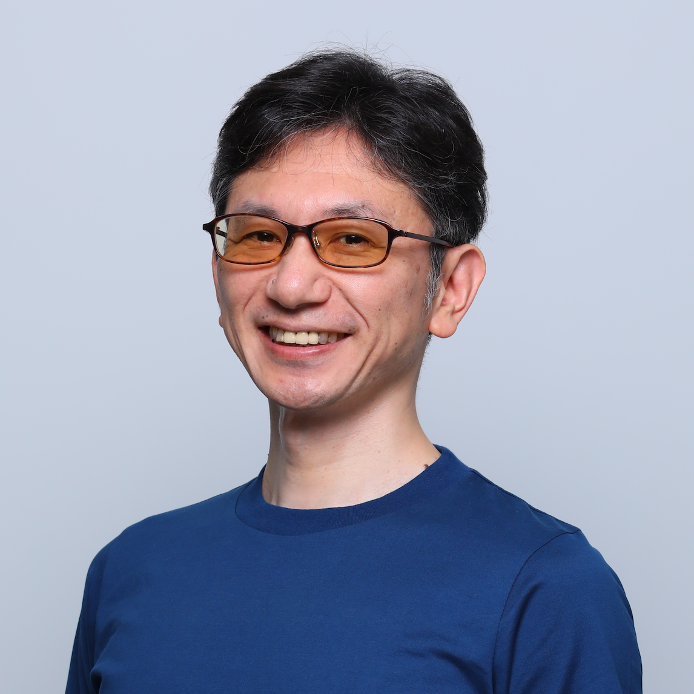

# makoga' profile

{: style="width:160px;border-radius:50%;box-shadow:0 0 8px rgba(0,0,0,0.1);display:block;margin:1em auto;"}

---

## プロフィール文

### 50文字程度
日本CTO協会理事。ex-LayerX / ex-CARTA・VOYAGE CTO。現在は探索期間。

### 100文字程度
VOYAGE GROUP / CARTA HOLDINGSでCTOを歴任。LayerXではバクラク事業VPoE、Principal / CTO室 室長を担当。現在は心身のアップデートと探索期間。日本CTO協会理事。

### 300文字程度
2010年にVOYAGE GROUPへ入社し、取締役CTOを務めた後、CARTA HOLDINGS 執行役員CTOなど、未上場期から上場後まで約11年にわたりCTOを歴任。2023年にLayerXへ入社し、バクラク事業VPoE、Principal / CTO室 室長として、技術組織マネジメントや技術広報に従事。2026年5月末に退職し、現在は心身のアップデートと、これから取り組むテーマの探索期間。日本CTO協会の立ち上げに関わり、現在も理事を務める。企画・監修した『Engineers in VOYAGE』はITエンジニア本大賞2021で大賞・特別賞を受賞。

---

## 経歴
- 2010年 - 2021年
    - 株式会社VOYAGE GROUP 取締役CTO / [株式会社CARTA HOLDINGS](https://cartaholdings.co.jp/) 執行役員CTOを歴任  
    - 企画・監修した[『Engineers in VOYAGE ― 事業をエンジニアリングする技術者たち』](https://www.lambdanote.com/products/engineers-in-voyage-ebook)が、[ITエンジニア本大賞2021で大賞・特別賞を受賞](https://www.shoeisha.co.jp/campaign/award/2021/result/)
- 2019年 - 現在
    - [日本CTO協会](https://cto-a.org/)の立ち上げに参画し、現在も理事を務める
- 2023年4月 - 2026年5月
    - [株式会社LayerX](https://layerx.co.jp/)に入社
    - 部門執行役員 バクラク事業VPoE、Principal / CTO室 室長を務めた

---

## 公開資料
- [Speaker Deck](https://speakerdeck.com/makoga)
- [note](https://note.com/makoga)

### 個別記事をピックアップ
- [アーカイブ公開！Bet AI Day & 7Days LT を終えて — イベント責任者のふりかえり](https://tech.layerx.co.jp/entry/betaiday-archive) @Layerxエンジニアブログ 
- [プロダクトチームのEMが実践している3つのマネジメント（戦略・達成・組織）](https://tech.layerx.co.jp/entry/three-management-practices-of-em) @Layerxエンジニアブログ
- [LayerX入社時インタビュー](https://note.layerx.co.jp/n/hd9e8f2e381fc) @LayerX note
- [新MVVができるまでのストーリーを大公開！（前編）](https://note.com/ctoa_ja/n/neab511b5f67e) / [新MVVができるまでのストーリーを大公開！（後編）](https://note.com/ctoa_ja/n/ne0f5b1299bf5) @日本CTO協会 note
- [2022年からCTO交代！新旧CTOが語るこれまでの10年とこれからのエンジニア組織と文化 / developers-summit-2022](https://speakerdeck.com/carta_engineering/2022nian-karactojiao-dai-xin-jiu-ctogayu-rukoremadefalse10nian-tokorekarafalseenziniazu-zhi-towen-hua) @CARTA Engineering Speaker Deck
- [面接時に見ているポイント](https://techblog.cartaholdings.co.jp/entry/2019/10/29/080000) @CARTA TECH BLOG
- [CTOに就任してからの5年間、VOYAGE GROUPで変わったこと・変わらなかったこと](https://techblog.cartaholdings.co.jp/entry/2015/12/24/125931) @CARTA TECH BLOG

---

## 好きなこと
- 漫画: 週刊少年ジャンプ、少年ジャンプ＋、その他いろいろ
- ゲーム: ゼルダ、マリオ、スパロボ、などなど
- ボルダリング: 一時期は週2,3回、最近は週に1回をキープ
- 将棋: 観る将、藤井聡太の棋譜は面白い
- 家族旅行: 毎年1つ新しい国に行きたい
